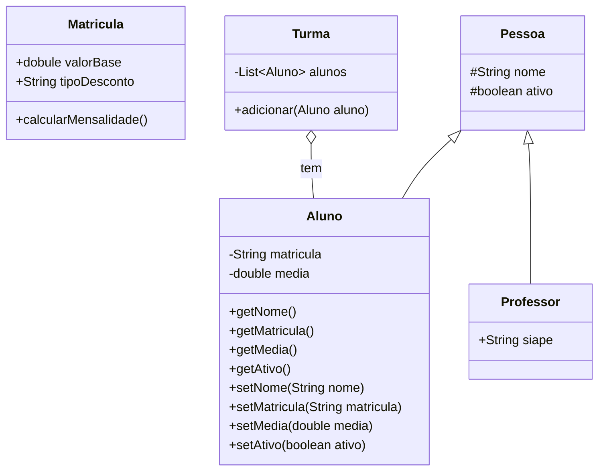

```mermaid
classDiagram
    class Aluno {
        -String matricula
        -double media
        +getNome()
        +getMatricula()
        +getMedia()
        +getAtivo()
        +setNome(String nome)
        +setMatricula(String matricula)
        +setMedia(double media)
        +setAtivo(boolean ativo)
    }
    class Matricula {
        +dobule valorBase
        +String tipoDesconto
        +calcularMensalidade()
    }
    class Pessoa {
        #String nome
        #boolean ativo
    }
    class Professor {
        +String siape
    }
    class Turma {
        -List~Aluno~ alunos
        +adicionar(Aluno aluno)
    }

    Pessoa <|-- Aluno
    Pessoa <|-- Professor
    Turma o-- Aluno : tem


```
